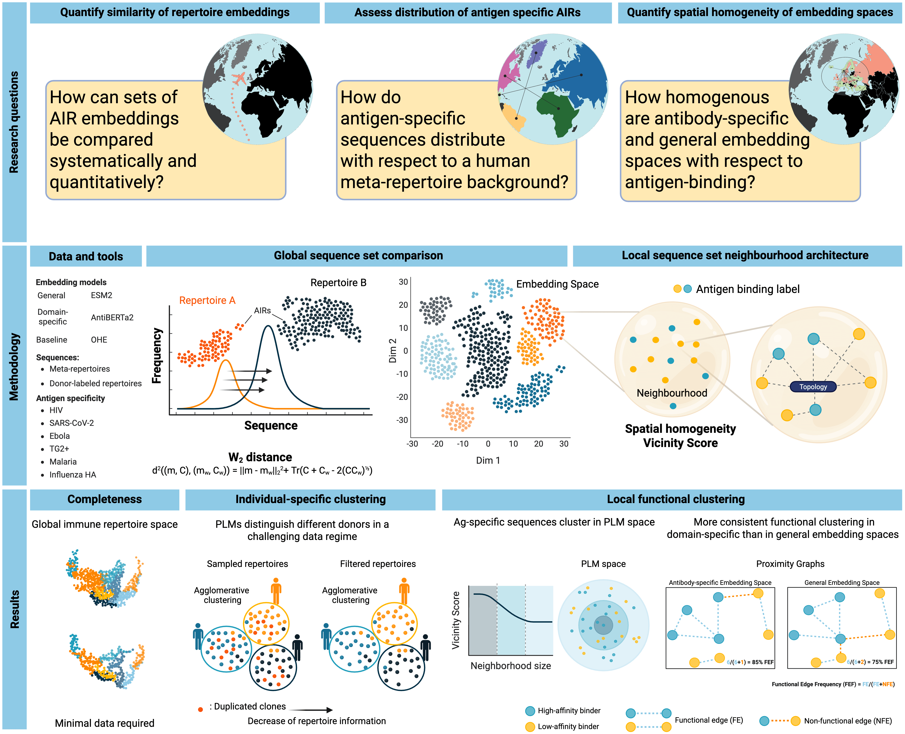

# Quantitative mapping of antigen specificity in adaptive immune repertoire embedding spaces 
## Overview
The adaptive immune receptor repertoire (AIRR) encompasses an immense diversity of antibody and T-cell receptor sequences, whose collective organization – how receptors are distributed, clustered, and interrelated across sequence and functional (e.g., antigen-binding) dimensions – remains poorly characterized. Representing AIRRs in continuous representation spaces that capture sequence, biochemical, and structural similarity between receptors may enable comparisons beyond discrete sequence features. Using both one-hot encodings and protein language model (PLM) embeddings, we developed a quantitative framework to map immune receptor organization at global (sequence-set-level) and local (single-sequence-level) scales. Applying the geometry-aware Wasserstein-2 distance, we show that the global structure of the AIRR space can be recovered from as few as ~105 sequence embeddings, at least 10 orders of magnitude smaller than the theoretical immune receptor diversity. We found that immune receptor sequences annotated with different antigen specificities occupy distinct regions of representation space. To resolve local relationships, we introduce a spatial homogeneity metric that quantifies the extent of functional clustering. We found higher spatial homogeneity in embedding spaces than in sequence space for diverse antigen-specific datasets. Our framework establishes a foundation for quantitative mapping of adaptive immune repertoire organization.

